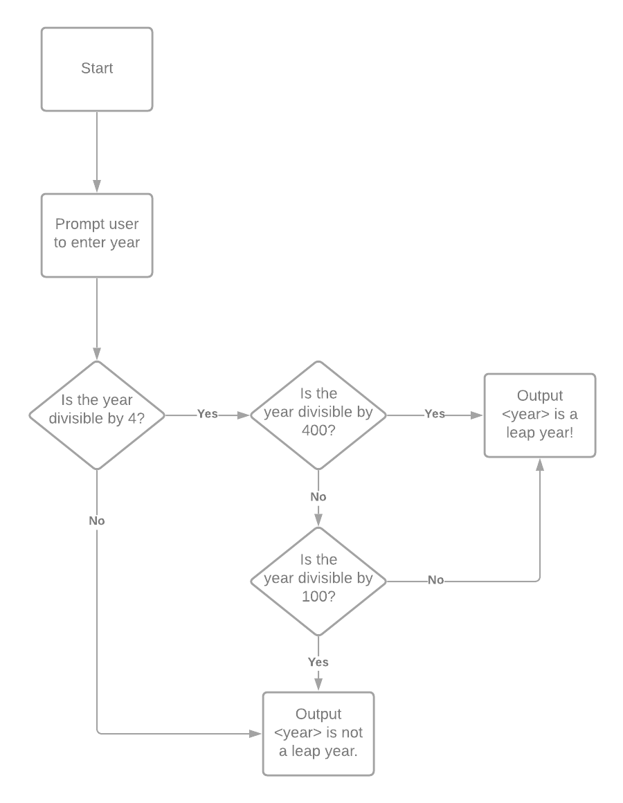
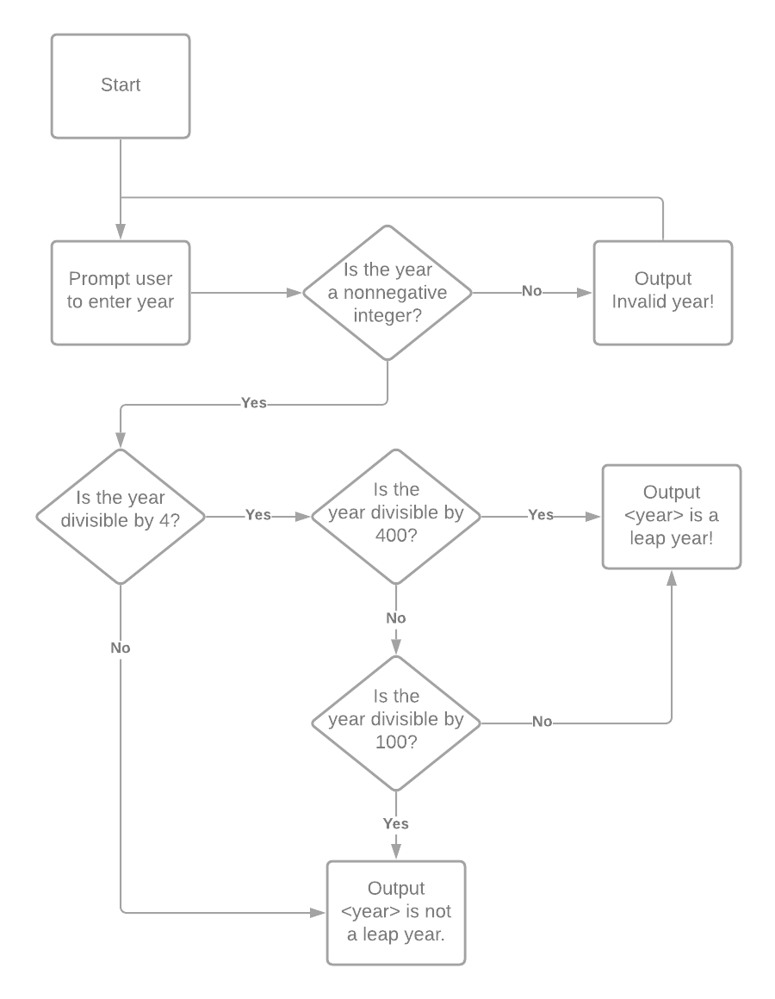

# Leap Year programs

## Leap year code without error handling
In the [first iteration](leapyear1.py) of this program, no error handling was implemented, as shown in the flowchart below.

## Leap year code with error handling
In the [second iteration](leapyear2.py) of this program, error handling *was* implemented, as shown in the flowchart below.

